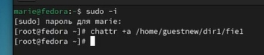

---
## Front matter
title: "Лабораторная работа 4"
subtitle: "Дискреционное
разграничение прав в Linux. Расширенные
атрибуты"
author: "Извекова Мария Петровна, НКАбд-01-22"

## Generic otions
lang: ru-RU
toc-title: "Содержание"

## Bibliography
bibliography: bib/cite.bib
csl: pandoc/csl/gost-r-7-0-5-2008-numeric.csl

## Pdf output format
toc: true # Table of contents
toc-depth: 2
lof: true # List of figures
lot: true # List of tables
fontsize: 12pt
linestretch: 1.5
papersize: a4
documentclass: scrreprt
## I18n polyglossia
polyglossia-lang:
  name: russian
  options:
	- spelling=modern
	- babelshorthands=true
polyglossia-otherlangs:
  name: english
## I18n babel
babel-lang: russian
babel-otherlangs: english
## Fonts
mainfont: PT Serif
romanfont: PT Serif
sansfont: PT Sans
monofont: PT Mono
mainfontoptions: Ligatures=TeX
romanfontoptions: Ligatures=TeX
sansfontoptions: Ligatures=TeX,Scale=MatchLowercase
monofontoptions: Scale=MatchLowercase,Scale=0.9
## Biblatex
biblatex: true
biblio-style: "gost-numeric"
biblatexoptions:
  - parentracker=true
  - backend=biber
  - hyperref=auto
  - language=auto
  - autolang=other*
  - citestyle=gost-numeric
## Pandoc-crossref LaTeX customization
figureTitle: "Рис."
tableTitle: "Таблица"
listingTitle: "Листинг"
lofTitle: "Список иллюстраций"
lotTitle: "Список таблиц"
lolTitle: "Листинги"
## Misc options
indent: true
header-includes:
  - \usepackage{indentfirst}
  - \usepackage{float} # keep figures where there are in the text
  - \floatplacement{figure}{H} # keep figures where there are in the text
---

# Цель работы

Получение практических навыков работы в консоли с расширенными
атрибутами файлов.

# Задание

Измения права атрибуты пользователя, посмотреть,какие права будут доступны для взаимодействия с файлом

# Теоретическое введение

Здесь описываются теоретические аспекты, связанные с выполнением работы.

Например, в табл. [-@tbl:std-dir] приведено краткое описание стандартных каталогов Unix.

: Описание некоторых каталогов файловой системы GNU Linux {#tbl:std-dir}

| Имя каталога | Описание каталога                                                                                                          |
|--------------|----------------------------------------------------------------------------------------------------------------------------|
| `/`          | Корневая директория, содержащая всю файловую                                                                               |
| `/bin `      | Основные системные утилиты, необходимые как в однопользовательском режиме, так и при обычной работе всем пользователям     |
| `/etc`       | Общесистемные конфигурационные файлы и файлы конфигурации установленных программ                                           |
| `/home`      | Содержит домашние директории пользователей, которые, в свою очередь, содержат персональные настройки и данные пользователя |
| `/media`     | Точки монтирования для сменных носителей                                                                                   |
| `/root`      | Домашняя директория пользователя  `root`                                                                                   |
| `/tmp`       | Временные файлы                                                                                                            |
| `/usr`       | Вторичная иерархия для данных пользователя                                                                                 |

Более подробно про Unix см. в [@tanenbaum_book_modern-os_ru; @robbins_book_bash_en; @zarrelli_book_mastering-bash_en; @newham_book_learning-bash_en].

# Выполнение лабораторной работы

Выполнение всей работы я делала в группе guestnew с файлом fie1

От имени пользователя guestnew определяем расширенные атрибуты файлаhome/guest/dir1/file1 командой lsattr /home/guest/dir1/file1 Установливаем командой chmod 600 file1 на файл fie1 права, разрешающие чтение и запись для владельца файла.(рис. [-@fig:001]).

{#fig:001 width=70%}

Нам не удалось выполнить эти действия, поэтому нам нужно зайти в консоль с правами администратора с помощью команды su. И далее делаем расширение атрибутов (рис. [-@fig:002]).

{#fig:002 width=70%}

Команда lsattr показывает, что мы расщирили атрибуты для файла fie1. Записываем в этот файл слово test, с помощью команды cat выводим на экран наше действие. (рис. [-@fig:003]).

{#fig:003 width=70%}

echo "abcd" должен был удалить нашу запись, однако это не произошло. вышла ошибка

Также попытались переименовать файл, но это не получилось (рис. [-@fig:004]).

{#fig:004 width=70%}

Снимаем расширенный атрибут (рис. [-@fig:005]).

{#fig:005 width=70%}

И проделываем все те же действия без этого атрибута. Как мы видим мы смогли переименовать файл, однако права для нашего нового файла мы установить не смогли  (рис. [-@fig:006]).

{#fig:006 width=70%}

Возвращаемся к правам администратора и расширыем атрибут i (рис. [-@fig:007]).

{#fig:007 width=70%}

Снова проделываем те же команды, что и с предыдущим атрибутом. МЫ видим, что команды ошибку не выдают, однако сами они не выполняются. И доступа так же нет. (рис. [-@fig:008]).

{#fig:008 width=70%}

# Выводы

Получили практические навыки работа в консоли с расширенными атрибутами

# Список литературы{.unnumbered}

::: {#refs}
:::
